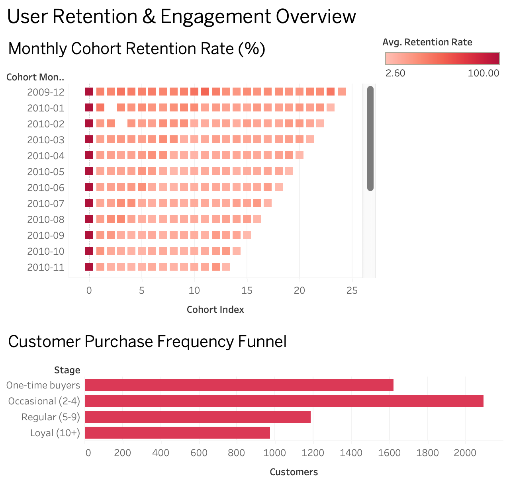
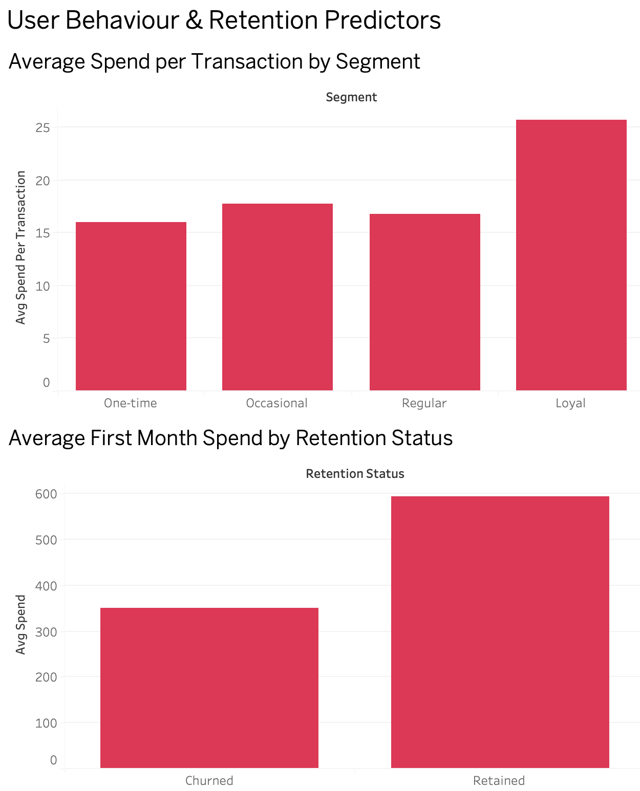

# User Retention & Engagement Analysis

## Overview
Analysed customer retention and user behaviour to uncover engagement patterns,
identify drop-off points, and surface early signals associated with long-term
retention, using real-world transaction data as a proxy for consumer app behaviour.

This is Part 2 of a two-part data analytics portfolio. [Part 1](https://github.com/tkaixinn/tiktok-content-integrity-analysis) examines content integrity and engagement patterns across TikTok videos.

## Project Highlights
- Analysed 805,549 cleaned transaction records across a two-year period
- Built 2 interactive Tableau dashboards for retention and behavioural analysis
- Applied cohort analysis, funnel analysis, and customer segmentation techniques
- Identified behavioural indicators associated with long-term customer retention

## Dashboard Preview

### Retention Overview

### User Behaviour Deep Dive

## Links
- [Dashboard 1 — Retention Overview](https://public.tableau.com/app/profile/tkaixinn/viz/UserRetentionAnalysis_17815418621350/RetentionOverview)
- [Dashboard 2 — User Behaviour Deep Dive](https://public.tableau.com/app/profile/tkaixinn/viz/UserBehaviourDeepDive/UserBehaviourDeepDive)

## Dataset
- Source: [UCI Online Retail II](https://www.kaggle.com/datasets/mashlyn/online-retail-ii-uci)
- 1,067,371 rows (805,549 clean rows), 8 columns
- Each row represents a product-level transaction from a UK-based online retailer (Dec 2009 to Dec 2011)

## Tools Used
- Python, Tableau

## Analysis Sections
1. Data Loading and Cleaning
2. Cohort Retention Analysis
3. Funnel Analysis
4. User Segmentation
5. Predictors of Retention
6. Summary and Recommendations

## Key Findings
1. Retention drops sharply after the first purchase, with most cohorts retaining 15 to 35% of customers in month 1, making early re-engagement an important period in the customer lifecycle
2. 27.6% of customers made only one purchase and never returned, representing the single largest drop-off point in the engagement funnel
3. Loyal customers spend an average of £25.65 per transaction, 60% more than one-time buyers at £16.02, despite being the smallest segment by customer count
4. Customers who were retained spent 69% more in their first month and averaged 1.4 transactions in Month 0 compared to 1.0 for churned customers, suggesting that early engagement depth may be associated with a higher likelihood of long-term retention

## Business Recommendations
1. Focus retention efforts within the first 30 days, where the largest customer drop-off occurs.

2. Encourage a second purchase through targeted promotions, personalised recommendations, and post-purchase engagement campaigns.

3. Identify and monitor customers with low Month 0 spending and transaction frequency, as they may be at higher risk of churn.

4. Develop predictive retention models using first-month engagement metrics to proactively identify at-risk customers.

## Skills Demonstrated
- Data Cleaning & Preprocessing (Python, pandas)
- Exploratory Data Analysis (Python, pandas, matplotlib, seaborn) 
- Cohort Analysis
- Funnel Analysis
- Customer Segmentation
- Behavioural Analytics
- Data Visualisation
- Tableau Dashboard Development
- Data-Driven Recommendation Development